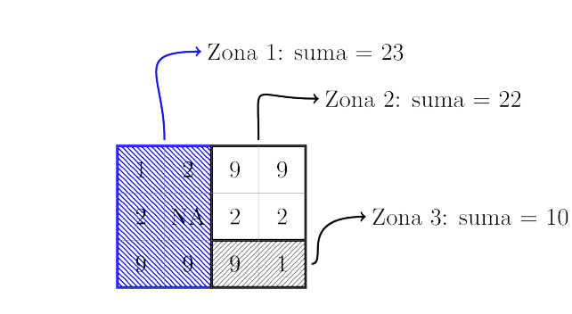

```{r setup, include=FALSE}
knitr::opts_chunk$set(echo = TRUE)
```

## Introducción
En `R` podemos encontrar una serie de paquetes que se pueden usar para leer, visualizar y analizar datos espaciales. En esta ocasión nos centraremos en la manipulación de  datos `raster`, específicamente nos centraremos en los paquetes:

* [`raster`](https://cran.r-project.org/web/packages/raster/vignettes/Raster.pdf)
* [`rasterVis`](https://cran.r-project.org/web/packages/rasterVis/rasterVis.pdf)
* [`fasterize`](https://cran.r-project.org/web/packages/fasterize/index.html)


```{r cars, message=FALSE, warning=FALSE}
if (!require(raster)) install.packages('raster',dependencies=T)
library(raster)
if (!require(rasterVis)) install.packages('rasterVis',dependencies=T)
library(rasterVis)
if (!require(velox)) install.packages('velox',dependencies=T)
library(velox)
if (!require(fasterize)) install.packages('fasterize',dependencies=T)
library(fasterize)
if (!require(sf)) install.packages('sf',dependencies=T)
library(sf)
if (!require(rgdal)) install.packages('rgdal',dependencies=T)
library(rgdal)
if (!require(tidyverse)) install.packages('rgdal',dependencies=T)
library(tidyverse)
```
Iniciaremos cargando un modelo digital de elevación.   

```{r}
MDE<-raster("Datos/Michoacan_60m.tif")
```

Al impimimir el objecto `RasterLayer` se muestra el resumen de los datos
```{r}
MDE
```
ahora realizemos el plot con de nuestro `MDE`

```{r}
plot(MDE)
```

##Corte y confección
El siguiente paso consiste en recortar el MDE para un area de interes especifica para esto emplearemos la funcion `crop()`. Para esto cargaremos primero un archivo vectorial usnado `shapefile()`.
```{r}
areaI<-shapefile("Datos/mun.shp")
areaI
plot(areaI)
```
```{r}
MDE_I<-crop(MDE,areaI)
MDE_I
```
```{r}
plot(MDE_I)
```

```{r}
plot(MDE_I)
plot(areaI, add=T)
```
```{r}
MDE_II<-mask(MDE_I,areaI)
MDE_II
plot(MDE_II)
plot(areaI,add=T)
```
Es posible explorar nuestro conjunto de datos usando `hist` y `boxplot`
```{r}
hist(MDE_II)
```
```{r}
boxplot(MDE_II)
```
Una operación bastante común cuando se trabaja con información espacial es el cambio de sistemas de referencia. Es decir proyectar de un sistema a otro para esto es crucial conocer el sistema de referencia de destino. Con el paquete `raster` podemos usar`projectRaster()` para este fin. 

En este caso voy a emplear el sistema de referencia Mexico [ITRF2008 / LCC](https://epsg.io/6372?fbclid=IwAR0M22mlOilhKhmK0X7e8ky-O9jKTT44rEB7MGfqNtDpGELG1TnGjKITnEo), para mayor informacion puede consultar http://geotiff.maptools.org/proj_list/

```{r}
crs(MDE_II)
```

```{r}
?projectRaster()
Rcrs<-CRS("+init=epsg:4326")
Rcrs
```

```{r}
#usando PROJ.4
RPROJ.4<-CRS("+proj=lcc +lat_1=17.5 +lat_2=29.5 +lat_0=12 +lon_0=-102 +x_0=2500000 +y_0=0 +ellps=GRS80 +towgs84=0,0,0,0,0,0,0 +units=m +no_defs") 
RPROJ.4

```

```{r warning=FALSE}
#MDE_LCC<-projectRaster(MDE_II,crs=Rcrs)
MDE_LCC<-projectRaster(MDE_II,crs=RPROJ.4)
```
```{r}
MDE_LCC
```
```{r}
pendiente<-terrain(MDE_LCC, opt='slope',unit='degrees')
plot(pendiente)
```
\newline
Es posible usar operadores lógicos para seleccionar un conjunto de pixeles que cumpla con un criterio determinado. Por ejemplo pixeles con un valor mayor a 10º.


```{r}
consulta1 <- pendiente > 10
consulta1
plot(consulta1, col = c("gray", "green"))
```
```{r}
consulta2 <- pendiente 
consulta2[ pendiente < 10]<-NA
consulta2
plot(consulta2)
```
```{r}
consulta3 <- pendiente 
consulta3[ pendiente < 10 | pendiente > 40]<-NA
consulta3
plot(consulta3)
```
\newline
El proceso de reclasificación es tarea cotidiana en el análisis espacial, en el siguiente ejemplo empleamos ` projectRaster()`. En este caso 

```{r}
m <- c(0, 15, 1,  15, 20, 2,  20, 60, 3)
clases <- matrix(m, ncol=3, byrow=TRUE)
clases
```

```{r}
rec = reclassify(pendiente, clases)
rec
plot(rec)
```

##Agregación de datos espaciales
Es posible modificar el arreglo espacial de las celdas agrupando celdas. La función `aggregate()` permite reagrupar varios pixeles, obteniendo un mapa raster de menor resolución espacial. La función `fun()` permite controlar el cálculo del valor del pixel de baja resolución que corresponde a varias celdas en los datos de entrada. En el siguiente ejemplos se reagrupan 2x2 pixeles, se promedian los valores de las cuatro celdas.

```{r}
MDE_agreg <- aggregate(MDE_LCC, fact=2, fun="mean")
MDE_agreg
```


##Operaciones zonales
El paquete `raster` permite también llevar a cabo operaciones zonales que consiste en calcular algún indice sobre una capa estratificando el cálculo en función en otra capa.  
  


```{r}
areaI_LCC<- spTransform(areaI, RPROJ.4)
areaI_LCC.sp<- st_as_sf(areaI_LCC)
```
```{r}
system.time(rasterize(areaI_LCC,MDE_LCC,field='Id'))

```
```{r}
system.time(fasterize(areaI_LCC.sp,MDE_LCC,field='Id'))
```

```{r}
mun_R<-fasterize(areaI_LCC.sp,MDE_LCC,field='Id')
plot(mun_R)
```

```{r}
Elev_P= zonal(MDE_LCC, mun_R, fun = "mean") %>%
  as.data.frame()
Elev_P
```
##Operaciones Focales
 `raster` permite realizar operaciones de filtrado espacial. La operacion focal a continuación  calcula desviacion estandar de los valores de las celdas en una ventana móvil de 7 x 7 pixeles.
```{r}
matrix(1,7,7)
```
```{r}
#pendiente.sd <- focal(pendiente, w = matrix(1,7,7), fun = sd,pad=T)
pendiente.sd <- focal(pendiente, w = matrix(1,7,7), fun = sd)
plot(pendiente.sd)

```

##Algebra de mapas

Para los siguientes ejemplos se usaran datos del producto `MOD13Q1`  de MODIS, específicamente la capa de  `NDVI`. En este producto los valores de NDVI tienen un factor de escala de `0.0001`.


```{r}
modis1<-raster("Datos/Modis/MOD13Q1_NDVI_2010_001.tif")
modis1
```
Ahora procederemos a escalar los valores de NDVI

```{r}
system.time(modis1/10000)

system.time(calc(modis1,function(x){x /10000}))
```

Los datos raster puede eventualmente manejarse como imágenes multibanda con stack() o brick().

```{r}
lmodis<-list.files(pattern = "MOD13*", recursive = TRUE, include.dirs = TRUE)
lmodis

```

```{r}
modis2010<-stack(lmodis)
modis2010
```
```{r}
#modis2010R<-mosdis2010/100000
modis2010R<-calc(modis2010,fun=function(x){x / 10000})
modis2010R
```

Como el usuario debe suponer en este momento también es posible realizar operaciones entre capas raster, nuevamente nos encontramos con diferentes maneras de abordar el problema.  

 
```{r}
r1<-raster(modis2010R,1)
r1
```

```{r}
r2<-modis2010R[[2]]
r2
```

```{r}
promedio<- (r1+r2) / 2
plot(promedio)
```
Por supuesto en este caso tenemos un conjunto de datos de 13 capas, en este caso podemos emplear la función `overlay()`, esta función es similar al paquete `calc()`. La diferencia radica en que `overlay()` esta pensado para agilizar las operaciones entre capas.

```{r}
#NDVI_promedio<-mean(modis2010R)
NDVI_promedio<-overlay(modis2010R, fun=mean)
NDVI_promedio
plot(NDVI_promedio, main="Promedio de NDVI de los primeros 100 dias del año 2010")
```


Para guardar un archivo raster es necesario conocer primero el tipo de dato que deseamos guardar. Para mayor información  consultar (https://www.rdocumentation.org/packages/raster/versions/2.8-4/topics/dataType)
```{r}
dataType(NDVI_promedio)
```

```{r}
writeRaster(NDVI_promedio,'NDVI_P.tif', format="GTiff",datatype="FLT4S", overwrite=TRUE)
```

##Mejorar la visualización  

El paquete `rasterVis` define métodos adicionales para el acceso, la manipulación y la visualización de datos raster. 

```{r}
plot(MDE_LCC,
     main="Modelo Digital de Elevación",
     cex.main = 0.7,
     col=viridisLite::viridis(10)) 
plot(areaI_LCC, add=T)
```
\newline
Aquí aplicamos la función leveplot () que está optimizada para mostrar datos ráster y que proporciona algunas características gráficas adicionales.


```{r}
m <- 100
levelplot(MDE_LCC,
          margin=FALSE,
          contour=TRUE,
          at=seq(0, maxValue(MDE_LCC), m),
          main = paste('Modelo Digital de Elevación, contorno', m, 'm'),
          par.settings=rasterTheme())
```

```{r}
histogram(MDE_LCC)

```

```{r}
levelplot(modis2010R)
```

##Recomendaciones 

* Si esta interesado en manejar grandes conjuntos de datos por favor revise el paquete [`velox`](https://cran.r-project.org/web/packages/velox/velox.pdf)
* Explore la función ` cluster()` del paquete `raster`, esta función permite paralelizar procesos de una manera bastante intuitiva usado `calc` y `overlay`

* Combine las funciones anteriores con pipes`%>%` esto le permitira tener un vida plena y feliz.    


