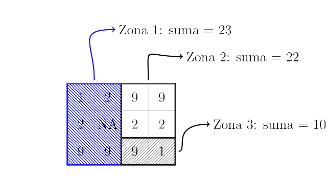

## Introducción
En `R` podemos encontrar una serie de paquetes que se pueden usar para leer, visualizar y analizar datos espaciales. En esta ocasión nos centraremos en la manipulación de  datos `raster`, específicamente nos centraremos en los paquetes:

* [`raster`](https://cran.r-project.org/web/packages/raster/vignettes/Raster.pdf)
* [`rasterVis`](https://cran.r-project.org/web/packages/rasterVis/rasterVis.pdf)
* [`fasterize`](https://cran.r-project.org/web/packages/fasterize/index.html)


```r
if (!require(raster)) install.packages('raster',dependencies=T)
library(raster)
if (!require(rasterVis)) install.packages('rasterVis',dependencies=T)
library(rasterVis)
if (!require(velox)) install.packages('velox',dependencies=T)
library(velox)
if (!require(fasterize)) install.packages('fasterize',dependencies=T)
library(fasterize)
if (!require(sf)) install.packages('sf',dependencies=T)
library(sf)
if (!require(rgdal)) install.packages('rgdal',dependencies=T)
library(rgdal)
if (!require(tidyverse)) install.packages('rgdal',dependencies=T)
library(tidyverse)
```
Iniciaremos cargando un modelo digital de elevación.   


```r
MDE<-raster("Datos/Michoacan_60m.tif")
```

Al impimimir el objecto `RasterLayer` se muestra el resumen de los datos

```r
MDE
```

```
## class       : RasterLayer 
## dimensions  : 4463, 6615, 29522745  (nrow, ncol, ncell)
## resolution  : 0.000555556, 0.000555556  (x, y)
## extent      : -103.7381, -100.0631, 17.91491, 20.39435  (xmin, xmax, ymin, ymax)
## coord. ref. : +proj=longlat +datum=WGS84 +no_defs +ellps=WGS84 +towgs84=0,0,0 
## data source : /Users/alequech/Documents/GitHub/Charla_RSpatialES_raster /Datos/Michoacan_60m.tif 
## names       : Michoacan_60m 
## values      : -32768, 32767  (min, max)
```
ahora realizemos el plot con de nuestro `MDE`


```r
plot(MDE)
```


##Corte y confección
El siguiente paso consiste en recortar el MDE para un area de interes especifica para esto emplearemos la funcion `crop()`. Para esto cargaremos primero un archivo vectorial usnado `shapefile()`.

```r
areaI<-shapefile("Datos/mun.shp")
areaI
```

```
## class       : SpatialPolygonsDataFrame 
## features    : 4 
## extent      : -102.5759, -101.9362, 19.17302, 19.62749  (xmin, xmax, ymin, ymax)
## coord. ref. : +proj=longlat +datum=WGS84 +no_defs +ellps=WGS84 +towgs84=0,0,0 
## variables   : 2
## names       :               NOM_MUN, Id 
## min values  : Nuevo Parangaricutiro,  1 
## max values  :               Uruapan,  4
```

```r
plot(areaI)
```


```r
MDE_I<-crop(MDE,areaI)
MDE_I
```

```
## class       : RasterLayer 
## dimensions  : 818, 1152, 942336  (nrow, ncol, ncell)
## resolution  : 0.000555556, 0.000555556  (x, y)
## extent      : -102.5759, -101.9359, 19.17324, 19.62769  (xmin, xmax, ymin, ymax)
## coord. ref. : +proj=longlat +datum=WGS84 +no_defs +ellps=WGS84 +towgs84=0,0,0 
## data source : in memory
## names       : Michoacan_60m 
## values      : 315, 3843  (min, max)
```

```r
plot(MDE_I)
```


```r
plot(MDE_I)
plot(areaI, add=T)
```


```r
MDE_II<-mask(MDE_I,areaI)
MDE_II
```

```
## class       : RasterLayer 
## dimensions  : 818, 1152, 942336  (nrow, ncol, ncell)
## resolution  : 0.000555556, 0.000555556  (x, y)
## extent      : -102.5759, -101.9359, 19.17324, 19.62769  (xmin, xmax, ymin, ymax)
## coord. ref. : +proj=longlat +datum=WGS84 +no_defs +ellps=WGS84 +towgs84=0,0,0 
## data source : in memory
## names       : Michoacan_60m 
## values      : 600, 3843  (min, max)
```

```r
plot(MDE_II)
plot(areaI,add=T)
```


Es posible explorar nuestro conjunto de datos usando `hist` y `boxplot`

```r
hist(MDE_II)
```


```r
boxplot(MDE_II)
```


Una operación bastante común cuando se trabaja con información espacial es el cambio de sistemas de referencia. Es decir proyectar de un sistema a otro para esto es crucial conocer el sistema de referencia de destino. Con el paquete `raster` podemos usar`projectRaster()` para este fin. 

En este caso voy a emplear el sistema de referencia Mexico [ITRF2008 / LCC](https://epsg.io/6372?fbclid=IwAR0M22mlOilhKhmK0X7e8ky-O9jKTT44rEB7MGfqNtDpGELG1TnGjKITnEo), para mayor informacion puede consultar http://geotiff.maptools.org/proj_list/


```r
crs(MDE_II)
```

```
## CRS arguments:
##  +proj=longlat +datum=WGS84 +no_defs +ellps=WGS84 +towgs84=0,0,0
```


```r
?projectRaster()
Rcrs<-CRS("+init=epsg:4326")
Rcrs
```

```
## CRS arguments:
##  +init=epsg:4326 +proj=longlat +datum=WGS84 +no_defs +ellps=WGS84
## +towgs84=0,0,0
```


```r
#usando PROJ.4
RPROJ.4<-CRS("+proj=lcc +lat_1=17.5 +lat_2=29.5 +lat_0=12 +lon_0=-102 +x_0=2500000 +y_0=0 +ellps=GRS80 +towgs84=0,0,0,0,0,0,0 +units=m +no_defs") 
RPROJ.4
```

```
## CRS arguments:
##  +proj=lcc +lat_1=17.5 +lat_2=29.5 +lat_0=12 +lon_0=-102
## +x_0=2500000 +y_0=0 +ellps=GRS80 +towgs84=0,0,0,0,0,0,0 +units=m
## +no_defs
```


```r
#MDE_LCC<-projectRaster(MDE_II,crs=Rcrs)
MDE_LCC<-projectRaster(MDE_II,crs=RPROJ.4)
```

```r
MDE_LCC
```

```
## class       : RasterLayer 
## dimensions  : 830, 1164, 966120  (nrow, ncol, ncell)
## resolution  : 58.2, 61.3  (x, y)
## extent      : 2439291, 2507036, 797136.1, 848015.1  (xmin, xmax, ymin, ymax)
## coord. ref. : +proj=lcc +lat_1=17.5 +lat_2=29.5 +lat_0=12 +lon_0=-102 +x_0=2500000 +y_0=0 +ellps=GRS80 +towgs84=0,0,0,0,0,0,0 +units=m +no_defs 
## data source : in memory
## names       : Michoacan_60m 
## values      : 600, 3833.119  (min, max)
```

```r
pendiente<-terrain(MDE_LCC, opt='slope',unit='degrees')
plot(pendiente)
```


\newline
Es posible usar operadores lógicos para seleccionar un conjunto de pixeles que cumpla con un criterio determinado. Por ejemplo pixeles con un valor mayor a 10º.


```r
consulta1 <- pendiente > 10
consulta1
```

```
## class       : RasterLayer 
## dimensions  : 830, 1164, 966120  (nrow, ncol, ncell)
## resolution  : 58.2, 61.3  (x, y)
## extent      : 2439291, 2507036, 797136.1, 848015.1  (xmin, xmax, ymin, ymax)
## coord. ref. : +proj=lcc +lat_1=17.5 +lat_2=29.5 +lat_0=12 +lon_0=-102 +x_0=2500000 +y_0=0 +ellps=GRS80 +towgs84=0,0,0,0,0,0,0 +units=m +no_defs 
## data source : in memory
## names       : layer 
## values      : 0, 1  (min, max)
```

```r
plot(consulta1, col = c("gray", "green"))
```


```r
consulta2 <- pendiente 
consulta2[ pendiente < 10]<-NA
consulta2
```

```
## class       : RasterLayer 
## dimensions  : 830, 1164, 966120  (nrow, ncol, ncell)
## resolution  : 58.2, 61.3  (x, y)
## extent      : 2439291, 2507036, 797136.1, 848015.1  (xmin, xmax, ymin, ymax)
## coord. ref. : +proj=lcc +lat_1=17.5 +lat_2=29.5 +lat_0=12 +lon_0=-102 +x_0=2500000 +y_0=0 +ellps=GRS80 +towgs84=0,0,0,0,0,0,0 +units=m +no_defs 
## data source : in memory
## names       : slope 
## values      : 10.00002, 53.83355  (min, max)
```

```r
plot(consulta2)
```


```r
consulta3 <- pendiente 
consulta3[ pendiente < 10 | pendiente > 40]<-NA
consulta3
```

```
## class       : RasterLayer 
## dimensions  : 830, 1164, 966120  (nrow, ncol, ncell)
## resolution  : 58.2, 61.3  (x, y)
## extent      : 2439291, 2507036, 797136.1, 848015.1  (xmin, xmax, ymin, ymax)
## coord. ref. : +proj=lcc +lat_1=17.5 +lat_2=29.5 +lat_0=12 +lon_0=-102 +x_0=2500000 +y_0=0 +ellps=GRS80 +towgs84=0,0,0,0,0,0,0 +units=m +no_defs 
## data source : in memory
## names       : slope 
## values      : 10.00002, 39.99954  (min, max)
```

```r
plot(consulta3)
```


\newline
El proceso de reclasificación es tarea cotidiana en el análisis espacial, en el siguiente ejemplo empleamos ` projectRaster()`. En este caso 


```r
m <- c(0, 15, 1,  15, 20, 2,  20, 60, 3)
clases <- matrix(m, ncol=3, byrow=TRUE)
clases
```

```
##      [,1] [,2] [,3]
## [1,]    0   15    1
## [2,]   15   20    2
## [3,]   20   60    3
```


```r
rec = reclassify(pendiente, clases)
rec
```

```
## class       : RasterLayer 
## dimensions  : 830, 1164, 966120  (nrow, ncol, ncell)
## resolution  : 58.2, 61.3  (x, y)
## extent      : 2439291, 2507036, 797136.1, 848015.1  (xmin, xmax, ymin, ymax)
## coord. ref. : +proj=lcc +lat_1=17.5 +lat_2=29.5 +lat_0=12 +lon_0=-102 +x_0=2500000 +y_0=0 +ellps=GRS80 +towgs84=0,0,0,0,0,0,0 +units=m +no_defs 
## data source : in memory
## names       : layer 
## values      : 0, 3  (min, max)
```

```r
plot(rec)
```


##Agregación de datos espaciales
Es posible modificar el arreglo espacial de las celdas agrupando celdas. La función `aggregate()` permite reagrupar varios pixeles, obteniendo un mapa raster de menor resolución espacial. La función `fun()` permite controlar el cálculo del valor del pixel de baja resolución que corresponde a varias celdas en los datos de entrada. En el siguiente ejemplos se reagrupan 2x2 pixeles, se promedian los valores de las cuatro celdas.


```r
MDE_agreg <- aggregate(MDE_LCC, fact=2, fun="mean")
MDE_agreg
```

```
## class       : RasterLayer 
## dimensions  : 415, 582, 241530  (nrow, ncol, ncell)
## resolution  : 116.4, 122.6  (x, y)
## extent      : 2439291, 2507036, 797136.1, 848015.1  (xmin, xmax, ymin, ymax)
## coord. ref. : +proj=lcc +lat_1=17.5 +lat_2=29.5 +lat_0=12 +lon_0=-102 +x_0=2500000 +y_0=0 +ellps=GRS80 +towgs84=0,0,0,0,0,0,0 +units=m +no_defs 
## data source : in memory
## names       : Michoacan_60m 
## values      : 603.2935, 3818.155  (min, max)
```


##Operaciones zonales
El paquete `raster` permite también llevar a cabo operaciones zonales que consiste en calcular algún indice sobre una capa estratificando el cálculo en función en otra capa.  
  


```r
areaI_LCC<- spTransform(areaI, RPROJ.4)
areaI_LCC.sp<- st_as_sf(areaI_LCC)
```

```r
system.time(rasterize(areaI_LCC,MDE_LCC,field='Id'))
```

```
##    user  system elapsed 
##  26.791   0.134  26.946
```

```r
system.time(fasterize(areaI_LCC.sp,MDE_LCC,field='Id'))
```

```
##    user  system elapsed 
##   0.013   0.005   0.019
```


```r
mun_R<-fasterize(areaI_LCC.sp,MDE_LCC,field='Id')
plot(mun_R)
```


```r
Elev_P= zonal(MDE_LCC, mun_R, fun = "mean") %>%
  as.data.frame()
Elev_P
```

```
##   zone     mean
## 1    1 2021.665
## 2    2 1618.826
## 3    3 2235.664
## 4    4 1906.949
```
##Operaciones Focales
 `raster` permite realizar operaciones de filtrado espacial. La operacion focal a continuación  calcula desviacion estandar de los valores de las celdas en una ventana móvil de 7 x 7 pixeles.

```r
matrix(1,7,7)
```

```
##      [,1] [,2] [,3] [,4] [,5] [,6] [,7]
## [1,]    1    1    1    1    1    1    1
## [2,]    1    1    1    1    1    1    1
## [3,]    1    1    1    1    1    1    1
## [4,]    1    1    1    1    1    1    1
## [5,]    1    1    1    1    1    1    1
## [6,]    1    1    1    1    1    1    1
## [7,]    1    1    1    1    1    1    1
```

```r
#pendiente.sd <- focal(pendiente, w = matrix(1,7,7), fun = sd,pad=T)
pendiente.sd <- focal(pendiente, w = matrix(1,7,7), fun = sd)
plot(pendiente.sd)
```


##Algebra de mapas

Para los siguientes ejemplos se usaran datos del producto `MOD13Q1`  de MODIS, específicamente la capa de  `NDVI`. En este producto los valores de NDVI tienen un factor de escala de `0.0001`.


```r
modis1<-raster("Datos/Modis/MOD13Q1_NDVI_2010_001.tif")
modis1
```

```
## class       : RasterLayer 
## dimensions  : 2359, 1836, 4331124  (nrow, ncol, ncell)
## resolution  : 232, 234  (x, y)
## extent      : 43895.63, 469847.6, 2449977, 3001983  (xmin, xmax, ymin, ymax)
## coord. ref. : +proj=utm +zone=13 +datum=WGS84 +units=m +no_defs +ellps=WGS84 +towgs84=0,0,0 
## data source : /Users/alequech/Documents/GitHub/Charla_RSpatialES_raster /Datos/Modis/MOD13Q1_NDVI_2010_001.tif 
## names       : MOD13Q1_NDVI_2010_001 
## values      : -2000, 9487  (min, max)
```
Ahora procederemos a escalar los valores de NDVI


```r
system.time(modis1/10000)
```

```
##    user  system elapsed 
##   0.575   0.232   1.068
```

```r
system.time(calc(modis1,function(x){x /10000}))
```

```
##    user  system elapsed 
##   0.494   0.052   0.548
```

Los datos raster puede eventualmente manejarse como imágenes multibanda con stack() o brick().


```r
lmodis<-list.files(pattern = "MOD13*", recursive = TRUE, include.dirs = TRUE)
lmodis
```

```
## [1] "Datos/Modis/MOD13Q1_NDVI_2010_001.tif"
## [2] "Datos/Modis/MOD13Q1_NDVI_2010_017.tif"
## [3] "Datos/Modis/MOD13Q1_NDVI_2010_033.tif"
## [4] "Datos/Modis/MOD13Q1_NDVI_2010_049.tif"
## [5] "Datos/Modis/MOD13Q1_NDVI_2010_065.tif"
## [6] "Datos/Modis/MOD13Q1_NDVI_2010_081.tif"
## [7] "Datos/Modis/MOD13Q1_NDVI_2010_097.tif"
```


```r
modis2010<-stack(lmodis)
modis2010
```

```
## class       : RasterStack 
## dimensions  : 2359, 1836, 4331124, 7  (nrow, ncol, ncell, nlayers)
## resolution  : 232, 234  (x, y)
## extent      : 43895.63, 469847.6, 2449977, 3001983  (xmin, xmax, ymin, ymax)
## coord. ref. : +proj=utm +zone=13 +datum=WGS84 +units=m +no_defs +ellps=WGS84 +towgs84=0,0,0 
## names       : MOD13Q1_NDVI_2010_001, MOD13Q1_NDVI_2010_017, MOD13Q1_NDVI_2010_033, MOD13Q1_NDVI_2010_049, MOD13Q1_NDVI_2010_065, MOD13Q1_NDVI_2010_081, MOD13Q1_NDVI_2010_097 
## min values  :                 -2000,                 -2000,                 -2000,                 -2000,                 -2000,                 -2000,                 -2000 
## max values  :                  9487,                  9818,                  9446,                  9812,                  9402,                  9216,                  9774
```

```r
#modis2010R<-mosdis2010/100000
modis2010R<-calc(modis2010,fun=function(x){x / 10000})
modis2010R
```

```
## class       : RasterBrick 
## dimensions  : 2359, 1836, 4331124, 7  (nrow, ncol, ncell, nlayers)
## resolution  : 232, 234  (x, y)
## extent      : 43895.63, 469847.6, 2449977, 3001983  (xmin, xmax, ymin, ymax)
## coord. ref. : +proj=utm +zone=13 +datum=WGS84 +units=m +no_defs +ellps=WGS84 +towgs84=0,0,0 
## data source : /private/var/folders/z6/7nkbhk316q1d2s06j6kybk5h0000gn/T/RtmppBO7Kt/raster/r_tmp_2018-11-29_190937_15482_51532.grd 
## names       : layer.1, layer.2, layer.3, layer.4, layer.5, layer.6, layer.7 
## min values  :    -0.2,    -0.2,    -0.2,    -0.2,    -0.2,    -0.2,    -0.2 
## max values  :  0.9487,  0.9818,  0.9446,  0.9812,  0.9402,  0.9216,  0.9774
```

Como el usuario debe suponer en este momento también es posible realizar operaciones entre capas raster, nuevamente nos encontramos con diferentes maneras de abordar el problema.  

 

```r
r1<-raster(modis2010R,1)
r1
```

```
## class       : RasterLayer 
## band        : 1  (of  7  bands)
## dimensions  : 2359, 1836, 4331124  (nrow, ncol, ncell)
## resolution  : 232, 234  (x, y)
## extent      : 43895.63, 469847.6, 2449977, 3001983  (xmin, xmax, ymin, ymax)
## coord. ref. : +proj=utm +zone=13 +datum=WGS84 +units=m +no_defs +ellps=WGS84 +towgs84=0,0,0 
## data source : /private/var/folders/z6/7nkbhk316q1d2s06j6kybk5h0000gn/T/RtmppBO7Kt/raster/r_tmp_2018-11-29_190937_15482_51532.grd 
## names       : layer.1 
## values      : -0.2, 0.9487  (min, max)
```


```r
r2<-modis2010R[[2]]
r2
```

```
## class       : RasterLayer 
## band        : 2  (of  7  bands)
## dimensions  : 2359, 1836, 4331124  (nrow, ncol, ncell)
## resolution  : 232, 234  (x, y)
## extent      : 43895.63, 469847.6, 2449977, 3001983  (xmin, xmax, ymin, ymax)
## coord. ref. : +proj=utm +zone=13 +datum=WGS84 +units=m +no_defs +ellps=WGS84 +towgs84=0,0,0 
## data source : /private/var/folders/z6/7nkbhk316q1d2s06j6kybk5h0000gn/T/RtmppBO7Kt/raster/r_tmp_2018-11-29_190937_15482_51532.grd 
## names       : layer.2 
## values      : -0.2, 0.9818  (min, max)
```


```r
promedio<- (r1+r2) / 2
plot(promedio)
```


Por supuesto en este caso tenemos un conjunto de datos de 13 capas, en este caso podemos emplear la función `overlay()`, esta función es similar al paquete `calc()`. La diferencia radica en que `overlay()` esta pensado para agilizar las operaciones entre capas.


```r
#NDVI_promedio<-mean(modis2010R)
NDVI_promedio<-overlay(modis2010R, fun=mean)
NDVI_promedio
```

```
## class       : RasterLayer 
## dimensions  : 2359, 1836, 4331124  (nrow, ncol, ncell)
## resolution  : 232, 234  (x, y)
## extent      : 43895.63, 469847.6, 2449977, 3001983  (xmin, xmax, ymin, ymax)
## coord. ref. : +proj=utm +zone=13 +datum=WGS84 +units=m +no_defs +ellps=WGS84 +towgs84=0,0,0 
## data source : /private/var/folders/z6/7nkbhk316q1d2s06j6kybk5h0000gn/T/RtmppBO7Kt/raster/r_tmp_2018-11-29_191024_15482_85418.grd 
## names       : layer 
## values      : -0.1297, 0.9007429  (min, max)
```

```r
plot(NDVI_promedio, main="Promedio de NDVI de los primeros 100 dias del año 2010")
```


Para guardar un archivo raster es necesario conocer primero el tipo de dato que deseamos guardar. Para mayor información  consultar (https://www.rdocumentation.org/packages/raster/versions/2.8-4/topics/dataType)

```r
dataType(NDVI_promedio)
```

```
## [1] "FLT4S"
```


```r
writeRaster(NDVI_promedio,'NDVI_P.tif', format="GTiff",datatype="FLT4S", overwrite=TRUE)
```

##Mejorar la visualización  

El paquete `rasterVis` define métodos adicionales para el acceso, la manipulación y la visualización de datos raster. 


```r
plot(MDE_LCC,
     main="Modelo Digital de Elevación",
     cex.main = 0.7,
     col=viridisLite::viridis(10)) 
plot(areaI_LCC, add=T)
```


\newline
Aquí aplicamos la función leveplot () que está optimizada para mostrar datos ráster y que proporciona algunas características gráficas adicionales.


```r
m <- 100
levelplot(MDE_LCC,
          margin=FALSE,
          contour=TRUE,
          at=seq(0, maxValue(MDE_LCC), m),
          main = paste('Modelo Digital de Elevación, contorno', m, 'm'),
          par.settings=rasterTheme())
```


```r
histogram(MDE_LCC)
```


```r
levelplot(modis2010R)
```


##Recomendaciones 

* Si esta interesado en manejar grandes conjuntos de datos por favor revise el paquete [`velox`](https://cran.r-project.org/web/packages/velox/velox.pdf)
* Explore la función ` cluster()` del paquete `raster`, esta función permite paralelizar procesos de una manera bastante intuitiva usado `calc` y `overlay`

* Combine las funciones anteriores con pipes`%>%` esto le permitira tener un vida plena y feliz.    


